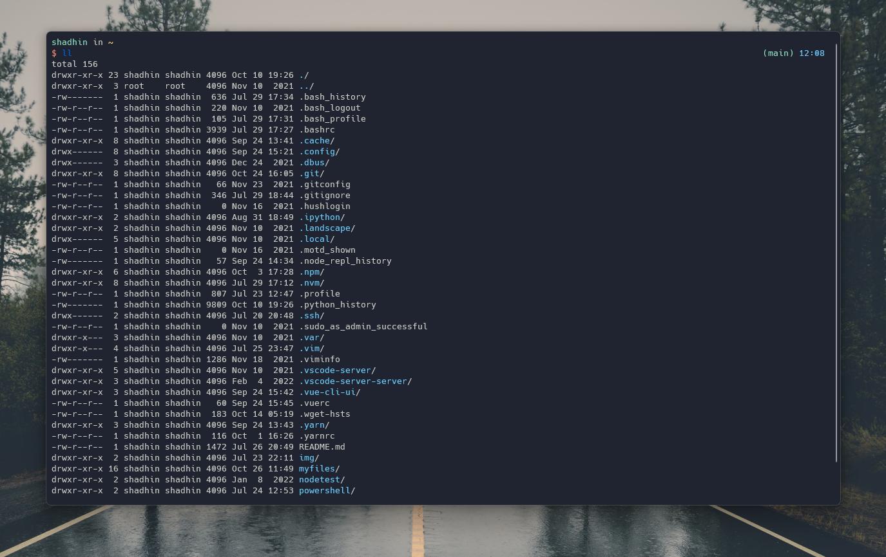

# $HOME

Terminal: [Windows Terminal](https://github.com/microsoft/terminal)

## Vim setup:
* [Neovim](https://github.com/neovim/neovim) (v0.7.2)
* [vim-plug](https://github.com/junegunn/vim-plug) - Plugin manager for Vim
* [nerd-tree](https://github.com/preservim/nerdtree) - File system explorer
* [vim-commentary](https://github.com/tpope/vim-commentary) - Comment stuff out!
* [auto-pairs](https://github.com/jiangmiao/auto-pairs) - Brackets, quotes autocomplete
* [vim-airline](https://github.com/vim-airline/vim-airline) - Nice statusline

## Shell setup (WSL)
* [Fish shell](https://fishshell.com/)
* [Fisher](https://github.com/jorgebucaran/fisher) - Plugin manager
* [Nerd fonts](https://github.com/ryanoasis/nerd-fonts) - I use Hack NF
* [z for fish](https://github.com/jethrokuan/z) - For directory jumping

## PowerShell setup (Windows)
* [Git for Windows](https://gitforwindows.org/)
* [Scoop](https://scoop.sh/) - Command line installer
* [Nerd fonts](https://github.com/ryanoasis/nerd-fonts) - I use Hack NF
* [Oh My Posh](https://ohmyposh.dev/) - Prompt theme engine
* [Terminal Icons](https://github.com/devblackops/Terminal-Icons) - Folder & file icons
* [PSReadLine](https://docs.microsoft.com/en-us/powershell/module/psreadline/?view=powershell-7.2) - For autocompletion
* [z](https://www.powershellgallery.com/packages/z/1.1.13) - For directory jumping